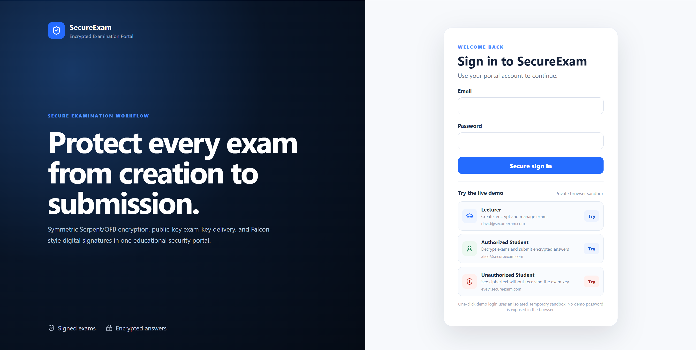
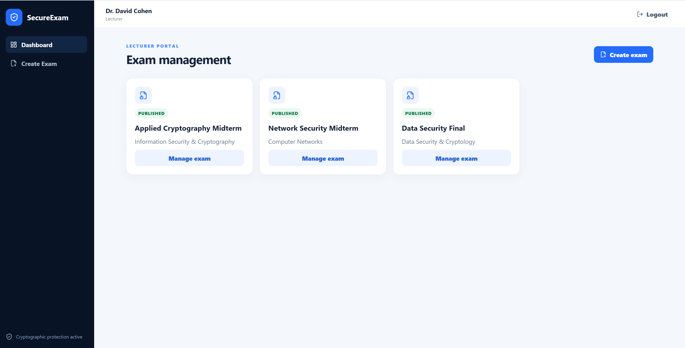
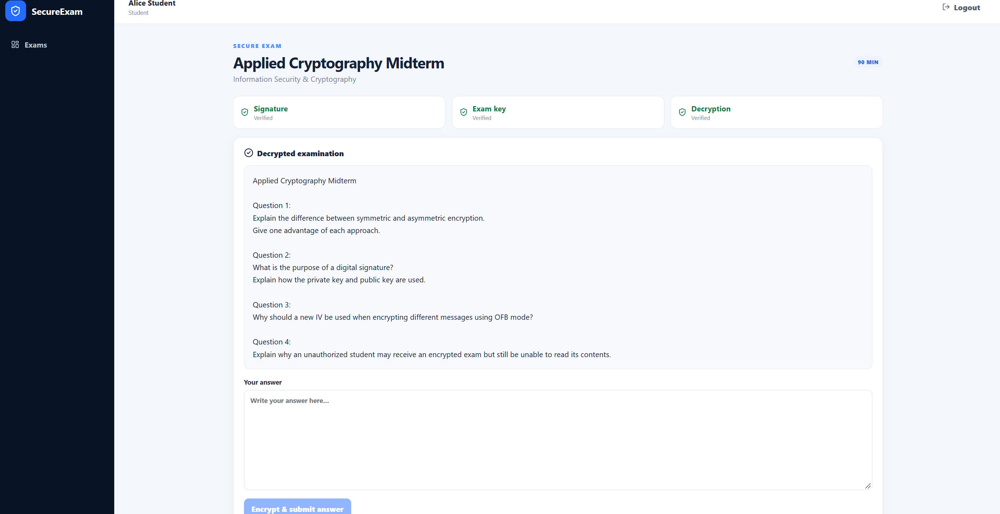
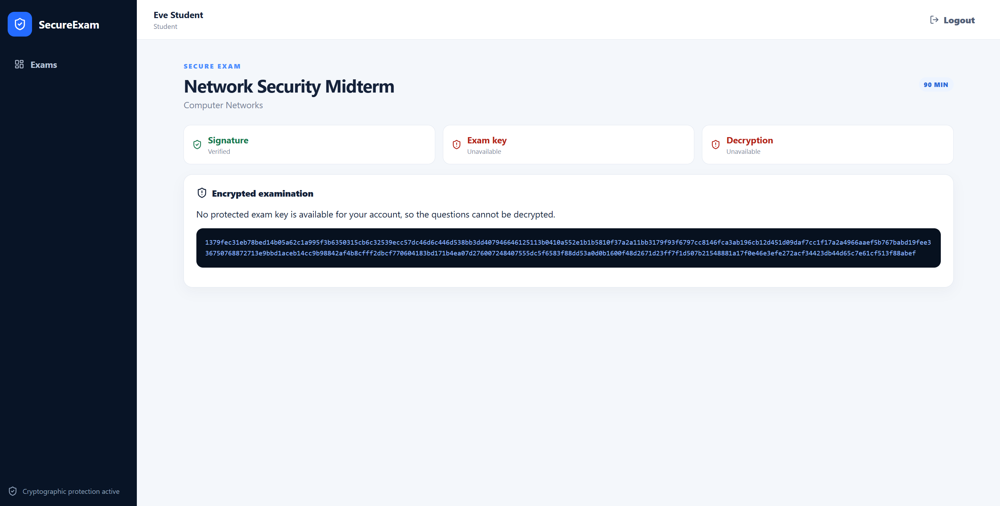
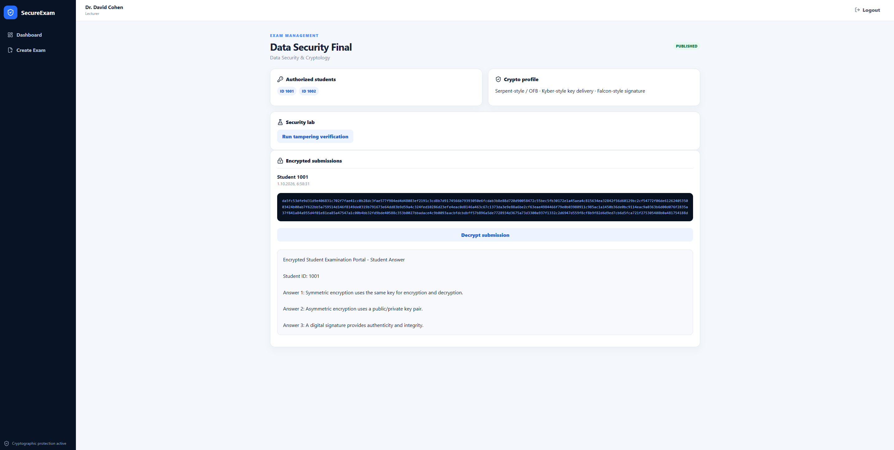
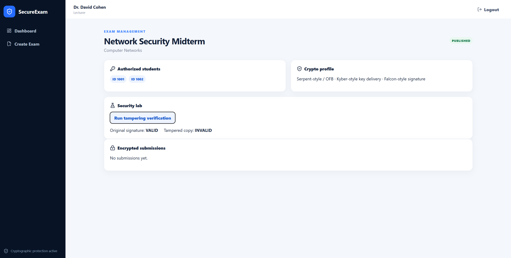

# SecureExam — Encrypted Examination Portal

<p align="center">
  <strong>
    Full-stack encrypted examination platform with a Python/FastAPI backend,
    React frontend, MySQL database, and educational cryptographic workflows.
  </strong>
</p>

<p align="center">
  
  
  
  
  
</p>

---

## Overview

**SecureExam** is a full-stack web application for secure exam distribution and encrypted student submissions.

The platform combines normal application authentication with a separate cryptographic authorization layer.

A student may therefore be able to see that an exam exists while still being unable to decrypt its questions without receiving the protected exam key.

The project includes:

- Python / FastAPI backend
- React frontend
- MySQL persistence
- JWT authentication
- Role-based access control
- Symmetric encryption
- Public/private key concepts
- Digital signatures
- Encrypted student submissions
- Tampering detection
- Isolated public demo sandboxes

> **Educational project:** the Kyber-style and Falcon-style modules are self-contained course implementations used to demonstrate cryptographic concepts. They are not official production implementations of the corresponding standards.

---

## Key Features

- **Lecturer dashboard** for creating, encrypting, publishing, and managing exams
- **Authorized student access** with signature verification, exam-key recovery, and decryption
- **Unauthorized student access** where ciphertext is visible but the exam key is unavailable
- **Encrypted student submissions** stored as ciphertext in MySQL
- **Lecturer-controlled decryption** of submitted answers
- **Fresh IV generation** for student answer encryption
- **Digital signature verification** before exam decryption
- **Tampering detection** when encrypted exam data is modified
- **JWT authentication and role-based access control**
- **One-click demo login** for the main roles
- **Isolated browser demo sessions** so different visitors do not modify each other's demo data

---

## Tech Stack

| Layer | Technologies |
|---|---|
| Backend | Python, FastAPI, Pydantic |
| Frontend | React, Vite, React Router, CSS |
| Database | MySQL, SQLAlchemy, PyMySQL |
| Authentication | JWT, Argon2 |
| Cryptography | Serpent-style / OFB, Kyber-style, Falcon-style |
| Testing | Pytest, HTTPX, ESLint |
| Deployment Ready | Docker, Vercel SPA configuration |

---

## Cryptographic Workflow

```text
Lecturer creates exam
        ↓
Generate symmetric exam key + IV
        ↓
Encrypt exam using Serpent-style / OFB
        ↓
Sign encrypted exam using Falcon-style signature
        ↓
Protect exam key for each authorized student
using the student's Kyber-style public key
        ↓
Student opens exam
        │
        ├── Signature invalid
        │       → Tampering detected
        │
        ├── No protected key package
        │       → Ciphertext only
        │
        └── Valid protected key package
                → Recover exam key
                → Decrypt exam
```

Student answers are also encrypted before storage.

Each submitted answer receives a **fresh IV**, and plaintext answers are not persisted in the submissions table.

---

## Screenshots

### Login & Demo Roles

One-click access to Lecturer, Authorized Student, and Unauthorized Student demo roles.



---

### Lecturer Dashboard

Lecturers can create new exams and manage published examinations.



---

### Authorized Student

The authorized student successfully verifies the signature, recovers the exam key, and decrypts the examination.



---

### Unauthorized Student

The unauthorized student can verify the exam signature but receives no protected exam key and therefore sees ciphertext only.



---

### Encrypted Student Submission

Student answers are stored as ciphertext. The lecturer can decrypt a submission on demand.



---

### Tampering Detection

The original encrypted exam passes signature verification, while a modified copy fails.

```text
Original signature: VALID
Tampered copy: INVALID
```



---

## Public Demo Sandbox

SecureExam separates the current login identity from the browser's temporary demo environment.

```text
JWT                → Who is logged in?
Demo session token → Which sandbox belongs to this browser?
```

This allows one visitor to test a complete flow:

```text
Lecturer
   ↓
Create and publish exam
   ↓ logout

Authorized Student
   ↓
Decrypt exam
   ↓
Submit encrypted answer
   ↓ logout

Unauthorized Student
   ↓
See ciphertext only
   ↓ logout

Lecturer
   ↓
View and decrypt submission
```

A different browser receives a different sandbox, preventing visitors from modifying each other's demo data.

---

## Project Structure

```text
SecureExam/
├── backend/
│   ├── app/
│   │   ├── api/
│   │   ├── core/
│   │   ├── crypto/
│   │   ├── models/
│   │   ├── schemas/
│   │   └── services/
│   ├── tests/
│   ├── Dockerfile
│   ├── init_db.py
│   ├── seed_demo.py
│   └── requirements.txt
│
├── frontend/
│   ├── src/
│   ├── vercel.json
│   └── package.json
│
├── legacy_console/
│
├── docs/
│   └── screenshots/
│
└── README.md
```

---

## Local Setup

### 1. Create MySQL Database

```sql
CREATE DATABASE secureexam
CHARACTER SET utf8mb4
COLLATE utf8mb4_unicode_ci;
```

---

### 2. Backend

```powershell
cd backend

python -m venv .venv

.\.venv\Scripts\Activate.ps1

pip install -r requirements.txt

Copy-Item .env.example .env
```

Update `backend/.env` with your MySQL credentials and JWT secret.

Then run:

```powershell
python init_db.py
python seed_demo.py
uvicorn app.main:app --reload
```

Backend:

```text
http://127.0.0.1:8000
```

Swagger:

```text
http://127.0.0.1:8000/docs
```

---

### 3. Frontend

Open another terminal:

```powershell
cd frontend

npm install

Copy-Item .env.example .env

npm run dev
```

Open:

```text
http://localhost:5173
```

---

## Testing

### Backend

```powershell
cd backend
pytest
```

### Frontend

```powershell
cd frontend
npm run lint
```

---

## Security Notes

SecureExam is an educational security project.

The project demonstrates:

- symmetric encryption,
- public/private key concepts,
- digital signatures,
- cryptographic authorization,
- encrypted database storage,
- and tampering detection.

For a real production system, additional protections would be required, such as dedicated key-management infrastructure, encrypted private-key storage, secret rotation, monitoring, and further application hardening.

---

## Original Course Version

The `legacy_console/` directory preserves the original Python console-based cryptography project.

The current web version extends that work into a full-stack platform with:

- React UI
- Python/FastAPI REST API
- MySQL database
- JWT authentication
- role-based access
- encrypted submissions
- digital-signature verification
- tampering detection
- public demo isolation

---

## Documentation

Additional documentation:

- [Public Demo Flow](PUBLIC_DEMO_FLOW.md)
- [Deployment Guide](DEPLOYMENT.md)

---

## Author

**Adel Bashir**  
B.Sc. Software Engineering Student  
Braude College of Engineering

GitHub: [adilbashir017-ux](https://github.com/adilbashir017-ux)

---

<p align="center">
  <strong>SecureExam — Protect every exam from creation to submission.</strong>
</p>